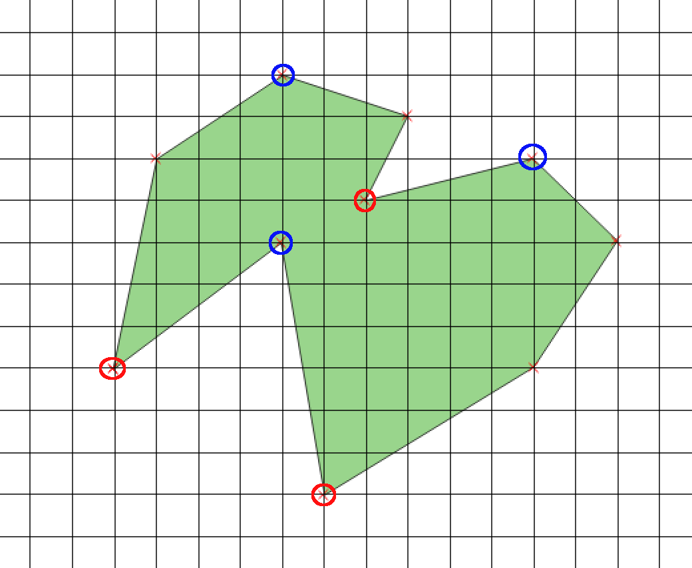
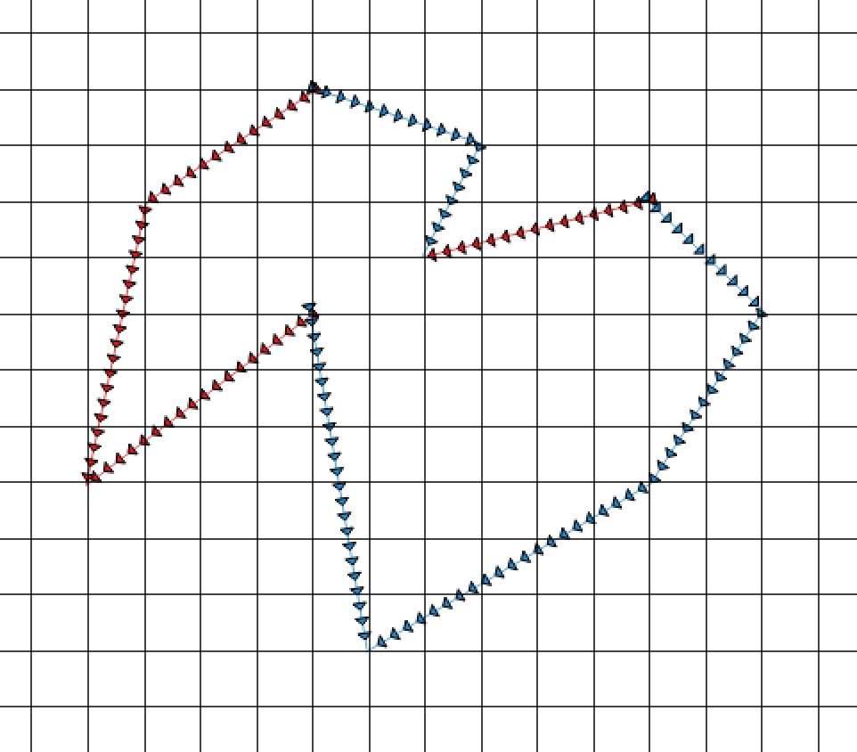

### Local Minimum and Local Maximum

The first part in understand Vatti is the concepts of local minima and local maxima. Local minima are points on a ring where both of the line segments from the point connect to values that are "below" the minima point, such that no other local minima will be located until a local maxima is found. 

That all sounds a bit complicated but a picture will clear it up quickly. Consider the ring below where the local minima are circled in blue and the local maxima are circled with red. 

Horizontal segments complicate this a little, but keep in mind that no local mimima can be followed by another local minima as you travel around a ring. 

Every local minimum on a ring has two [bounds](bounds.md), a left bound and a right bound. A [bound](bounds.md) is a series of [edges](edges.md) that start at a local minimum and travel towards a local maximum. We can locate the bounds from the ring shown above in the picture below - left bounds are colored red and right bounds are colored in blue.

You can see the start and end of the bounds by the direction the arrow travels, starting at a local mimima and traveling to a local maximum. 
